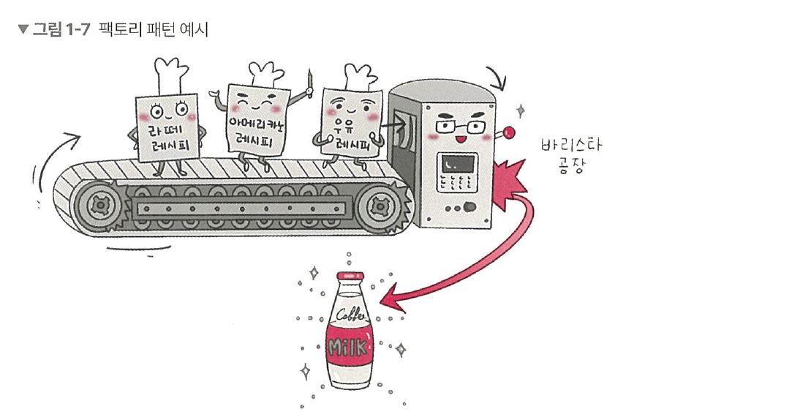
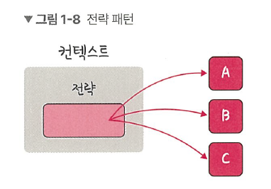
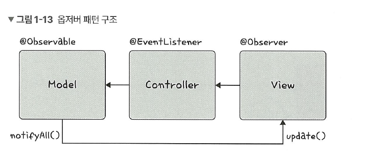
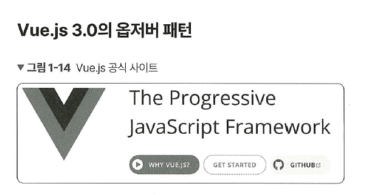

# 1.1 디자인 패턴 

> **💡 구성**
> 
> 1장에서는 디자인 패턴을 다룹니다. 이론뿐만 아니라 실제로 어떻게 디자인 패턴이 쓰이고 있는지를 서술했습니다. 예를 들어 ‘전략 패턴은 passport 라이브러리에서 사용된다’처럼 실무에서 어떻게 사용되고 있는지를 구체적으로 알려줍니다. 예시 코드로는 자바, 자바스크립트 두 가지의 언어로 구성했고, 코드의 난이도를 최대한 낮추면서도 디자인 패턴을 잘 표현하도록 노력했습니다.

우리가 흔히 프로그래밍할 때 쓰는 `React.js` , `Vue.js` , `Spring` 등 라이브러리나 프레임워크의 기본이 되는 디자인 패턴과 크게 보았을 때 어떠한 방식으로 로직을 구성해야 하는지에대한 시각이 담겨 있는 프로그래밍 패러다임을 배워 보겠습니다.

> **💡 용어**
> 
> 1. **라이브러리**  
공통으로 사용될 수 있는 특정한 기능들을 모듈화한 것을 의미한다. 폴더명, 파일명 등에 대한 규칙이 없고 프레임워크에 비해 자유롭다. 예를 들어 무언가를 자를 때 ‘도구’인 **`‘가위’`**를 사용해서 ‘내가’ 직접 컨트롤하여 자르는데, 라이브러리는 이와 비슷하다.
> 2. **프레임워크**  
공통으로 사용될 수 있는 특정한 기능들을 모듈화한 것을 의미한다. 폴더명, 파일명 등에 대한 규칙이 있으며 라이브러리에 비해 좀 더 엄격하다. 다른 곳으로 이동할 때 ‘도구’인 **`비행기`**를 타고 이동하지만 ‘비행기’가 컨트롤하고 나는 가만히 앉아 있어야 한다. 프레임워크는 이와 비슷하다. 

디자인 패턴이란 프로그램을 설계할 때 발생했던 문제점들을 객체 간의 상호 관계 등을 이용하여 해결할 수 있도록 하나의 ‘규약’ 형태로 만들어 놓은 것을 의미합니다.

여기서는 다양한 디자인 패턴을 `JavaScript`, `Java` 로 된 코드와 함께 살펴봅니다. 모든 코드는 별도의 프로그램을 설치하지 않고 웹에서 실행할 수 있습니다. 

자바스크립트는 다음 링크에서 쉽게 테스팅할 수 있습니다.
- 플레이코드 링크 : https://playcode.io/new


자바는 다음 링크에서 쉽게 테스팅할 수 있습니다.
- 코딩그라운드 링크 : https://www.tutorialspoint.com/compilers/online-java-compiler.htm


## 1.1.1 싱글톤 패턴
싱글톤 패턴(singleton pattern)은 하나의 클래스에 오직 하나의 인스턴스만 가지는 패턴입니다. 하나의 클래스를 기반으로 여러 개의 개별적인 인스턴스를 만들 수 있지만, 그렇게 하지 않고 하나의 클래스를 기반으로 단 하나의 인스턴스를 만들어 이를 기반으로 로직을 만드는 데 쓰이며, 보통 데이터베이스 연결 모듈에 많이 사용합니다.


하나의 인스턴스를 만들어 놓고 해당 인스턴스를 다른 모듈들이 공유하며 사용하기 때문에 인스턴스를 생성할 때 드는 비용이 줄어드는 장점이 있습니다. 하지만 의존성이 높아진다는 단점이 있습니다.

### 자바스크립트의 싱글톤 패턴

자바스크립트에서는 리터럴 {} 또는 new Object로 객체를 생성하게 되면 다른 어떤 객체와도 같지 않기 때문에 이 자체만으로 싱글톤 패턴을 구현할 수 있습니다.

자바스크립트에서 싱글톤 패턴은 다음과 같이 만들 수 있습니다.

```jsx
// 코드 위치 : ch1/1.js

const obj = {
	a: 27
}

const obj2 = {
	a: 27
}
console.log(obj === obj2)
// fale
```

앞의 코드에서 볼 수 있듯이 `obj`와 `obj2`는 다른 인스턴스를 가집니다. 이 또한 new Object 라는 클래스에서 나온 단 하나의 인스턴스니 어느 정도 싱글톤 패턴이라 볼 수 있지만, 실제 싱글톤 패턴은 보통 다음과 같은 코드로 구성됩니다.

```jsx
// 코드 위치 : ch1/2.js

class Singleton {
	constructor() {
		if (!Singleton.instance) {
			Singleton.instance = this
		}
		return Singleton.instance
	}
	getInstance() {
		return this
	}
}
const a = new Singleton()
const b = new Singleton()
console.log(a === b)  // true
```

앞의 코드는 `Singleton.instance` 라는 하나의 인스턴스를 가지는 Singleton 클래스를 구현한 모습입니다. 이를 통해 a와 b는 하나의 인스턴스를 가집니다. 

### 데이터베이스 연결 모듈

앞서 설명한 싱글톤 패턴은 데이터베이스 연결 모듈에 많이 쓰입니다.

```jsx
// 코드위치 : ch1/3.js

const URL = 'mongodb://localhost:27017/kundolapp'
const createConnection = url => ({"url" : url})
class DB {
	constructor(url) {
		if (!DB.instance) {
			DB.instance = createConnection(url)
		}
		return DB.instance
	}
	connect() {
		return this.instance
	}
}
const a = new DB(URL)
const b = new DB(URL)
console.log(a === b)  // true
```

이렇게 `DB.instance` 라는 하나의 인스턴스를 기반으로 a, b를 생성하는 것을 볼 수 있었습니다. 이를 통해 데이터베이스 연결에 관한 인스턴스 생성 비용을 아낄 수 있습니다. 

### 자바에서의 싱글톤 패턴

자바로는 다음과 같이 중첩 클래스를 이용해서 만드는 방법이 가장 대중적입니다. 더 자세히 알고 싶다면 필자의 유튜브 채널인 ‘큰돌의 터전 - JAVA로 싱글톤 패턴을 구현하는 7가지 방법’ 영상을 참고해주세요.

```java
// 코드 위치 : ch1/4.java

class Singleton {
	private static class singleInstanceHolder {
		private static final Singleton INSTANCE = new Singleton();
	}
	public static Singleton getInstance() {
		return singleInstanceHolder.INSTANCE;
	}
}

public class HelloWorld {
	public static void main(String[] arge) {
		Singleton a = Singleton.getInstance();
		Singleton b = Singleton.getInstance();
		System.out.printIn(a.hashCode());
		System.out.printIn(b.hashCode());
		if (a == b) {
			System.out.printIn(true);
		}
	}
}
/*
705927765
705927765
*/
```

### mongoose의 싱글톤 패턴


실제로 싱글톤 패턴은 Node.js에서 MongoDB 데이터베이스를 연결할 때 쓰는 mongoose 모듈에서 볼 수 있습니다.

moggoose의 데이터베이스를 연결할 때 쓰는 `connect()` 라는 함수는 싱글톤 인스턴스를 반환합니다. 다음은 `connect()` 함수를 구현할 때 쓰인 실제 코드입니다. 

```jsx
Monggoose.proottype.connect = function(uri, options, callback) {
	const_monggoose = this instanceof Monggoose ? this : monggoose;
	const conn = _mongoose.connection;
	
	return _mongoose._promiseOrCallback(callback, cb => {
		conn.openUri(uri, options, err => {
			if (err != null) {
				return cb(err);
			}
			return cb(null, _mongoose);
		});
	});
};
```

### MySQL의 싱글톤 패턴


Node.js에서 MySQL 데이터베이스를 연결할 때도 싱글톤 패턴이 쓰입니다. 

```jsx
// 메인 모듈
const mysql = require('mysql');
const pool = mysql.createPool({
	connectionLimit: 10,
	host: 'example.org',
	user: 'kundol',
	password: 'secret',
	database: '승철이디비'
});
pool.connect();

// 모듈 A
pool.query(query, function (error, results, fields) {
	if (error) throw error;
	console.log('The solution is: ', results[0].solution);
});

// 모듈 B
pool.query(query, function (error, results, fields) {
	if (error) throw error;
	console.log('The solution is: ', results[0].solution);
});
```

앞의 코드처럼 메인 모듈에서 데이터베이스 연결에 관한 인스턴스를 정의하고 다르모듈인 A 또는 B에서 해당 인스턴스를 기반으로 쿼리를 보내는 형식으로 쓰입니다.

### 싱글톤 패턴의 단점

싱글톤 패턴은 TDD(Test Driven Development)를 할 때 걸림돌이 됩니다. TDD를 할 때 단위 테스트를 주로 하는데, 단위 테스트는 테스트가 서로 독립적이어야 하며 테스트를 어떤 순서로든 실행할 수 있어야 합니다.

하지만 싱글톤 패턴은 미리 생성된 하나의 인스턴스를 기반으로 구현하는 패턴이므로 각 테스트마다 ‘독립적인’ 인스턴스를 만들기가 어렵습니다.

### 의존성 주입

또한, 싱글톤 패턴은 사용하기가 쉽고 굉장히 실용적이지만 모듈 간의 결합을 강하게 만들 수 있다는 단점이 있습니다. 이때 의존성 주입(DI, Dependency Injection)을 통해 모듈 간의 결합을 조금 더 느슨하게 만들어 해결할 수 있습니다.

참고로 의존성이란 종속성이라고도 하며 A가 B에 의존성이 있다는 것은 B의 변경사항에 대해 A 또한 변해야 된다는 것을 의미합니다. 


앞의 그림처럼 메인 모듈(main mudule)이 ‘직접’ 다른 하위 모듈에 대한 의존성을 주기보다는 중간에 의존성 주입자(dependency injector)가 이 부분을 가로채 메인 모듈이 ‘간접’적으로 의존성을 주입하는 방식입니다.

이를 통해 메인 모듈(상위 모듈)은 하위 모듈에 대한 의존성이 떨어지게 됩니다. 참고로 이를 ‘디커플링이 된다’고도 합니다.

> **💡 의존성 주입의 장점**
> 
> 모듈들을 쉽게 교체할 수 있는 구조가 되어 테스팅하기 쉽고 마이그레이션하기도 수월합니다. 또한, 구현할 때 추상화 레이어를 넣고 이를 기반으로 구현체를 넣어 주기 때문에 애플리케이션 의존성 방향이 일관되고, 애플리케이션을 쉽게 추론할 수 있으며, 모듈 간의 관계들이 조금 더 명확해집니다.

> **💡 의존성 주입의 단점**
> 
> 모듈들이 더욱더 분리되므로 클래스 수가 늘어나 복잡성이 증가될 수 있으며 약간의 런타임 패널티가 생기기도 합니다.

> **💡 의존성 주입 원칙**  
>
> 의존성 주입은 “상위 모듈은 하위 모듈에서 어떠한 것도 가져오지 않아야 합니다. 또한, 둘 다 추상화에 의존해야 하며, 이때 추상화는 세부 사항에 의존하지 말아야 합니다.”라는 의존성 주입 원칙을 지켜주면서 만들어야 합니다.

## 1.1.2 팩토리 패턴 
**팩토리 패턴(factory pattern)** 은 객체를 사용하는 코드에서 객체 생성 부분을 떼어내 추상화한 패턴이자 상속 관계에 있는 두 클래스에서 상위 클래스가 중요한 뼈대를 결정하고, 하위 클래스에서 객체 생성에 관한 구체적인 내용을 결정하는 패턴입니다.  
상위 클래스와 하위 클래스가 분리되기 때문에 느슨한 결합을 가지며 상위 클래스에서는 인스턴스 생성 방식에 대해 전혀 알 필요가 없기 때문에 더 많은 유연성을 갖게 됩니다. 그리고 객체 생성 로직이 따로 떼어져 있기 때문에 코드를 리팩터링하더라도 한 곳만 고칠 수 있게 되니 유지 보수성이 증가됩니다.
예를 들어 라떼 레시피와 아메리카노 레시피, 우유 레시피라는 구체적인 내용이 들어 있는 하위 클래스가 컨베이어 벨트를 통해 전달되고, 상위 클래스인 바리스타 공장에서 이 레시피들을 토대로 우유 등을 생산하는 생산 공정을 생각하면 됩니다. 



### 자바스크립트의 팩토리 패턴
자바스크립트에서 팩토리 패턴을 구현한다면 간단하게 new Object()로 구현할 수 있습니다.
```jsx
const num = new Object(42)
const str = new Object('abc')
num.constructor.name;  // Number
str.constructor.name;  // String
```

숫자를 전달하거나 문자열을 전달함에 따라 다른 타입의 객체를 생성하는 것을 볼 수 있습니다. 즉, 전달받은 값에 따라 다른 객체를 생성하며 인스턴스의 타입 등을 정합니다.
커피 팩토리를 기반으로 라떼 등을 생산하는 코드를 구축해보겠습니다.
```jsx
class CoffeeFacotry {
	static createCoffee(type) {
		const factory = factoryList[type]
		return factory.createCoffee()
	}
}

class Latte {
	constructor() {
		this.name = "latte"
	}
}
class Espresso{
	constructor() {
		this.name = "Espresso"
	}
}
class LatteFactory extends CoffeeFactory {
	static createCoffee() {
		return new Latte()
	}
}
class EspressoFactory extends CoffeeFactory {
	static createCoffee() {
		return new Espresso()
	}
}
const factoryList = { LatteFacotry, EspressoFacotry }

const main = () => {
	// 라떼 커피를 주문한다.
	const coffee = CoffeFactory.createCoffee("LatteFactory")
	// 커피 이름을 부른다
	console.log(coffee.name)  // latte
}
main()
```

CoffeeFactory라는 상위 클래스가 중요한 뼈대를 결정하고 하위 클래스인 LatteFactory가 구체적인 내용을 결정하고 있습니다. 
참고로 이는 의존성 주입이라고도 볼 수 있습니다. CoffeeFactory에서 LatteFactory의 인스턴스를 생성하는 것이 아닌 LatteFactory에서 생성한 인스턴스를 CoffeeFactory에 주입하고 있기 때문입니다.
또한, CoffeeFactory 클래스를 보면 static 키워드를 통해 createCoffee() 메서드를 정적 메서드로 선언한 것을 볼 수 있는데, 이렇게 정적 메서드로 정의하면 클래스를 기반으로 객체를 만들지 않고 호출이 가능하며, 해당 메서드에 대한 메모리 할당을 한 번만 할 수 있는 장점이 있습니다.

### 자바의 팩토리 패턴
이를 자바로 구현하면 다음과 같습니다.
```java
enum CoffeeType {
	LATTE,
	ESPRESSO
}

abstract class Coffee {
	protected String name;
	
	public String getName() {
		return name;
	}
}

class Latte extends Coffee {
	public Latte() {
		name = "latte";
	}
}
class Expresso extends Coffee {
	public Expresso() {
		name = "Expresso";
	}
}

class CoffeeFactory {
	public static Coffee createCoffee(CoffeeType type) {
		switch (type) {
			case LATTE:
				return new Latte();
			case EXPRESSO:
				return new Espresso();
			default:
				throw new IllegalArgumentException("Invalid coffee type: " + type);
		}
	}
}

public class Main {
	public static void main(String[] args) {
		Coffee coffee = CoffeeFactory.createCoffee(CoffeeType.LATTE);
		System.out.printIn(coffee.getName());  // latte
	}
}
```

앞의 코드는 CoffeeFactory 밑에 Coffee 클래스를 놓고 해당 클래스를 상속하는 Latte, Espresso 클래스를 기반으로 구현한 모습입니다. 

> **💡 용어**
> 
> 1. **Enum**  
상수의 집합을 정의할 때 사용되는 타입이다. 예를 들어 월, 일, 색상 등의 상수 값을 담는다. 자바에서는 Enum이 다른 언어보다 더 활발히 활용되며, 상수뿐만 아니라 메서드를 집어넣어 관리할 수도 있다. Enum을 기반으로 상수 집합을 관리한다면 코드를 리패터링할 때 상수 집합에 대한 로직 수정 시 이 부분만 수정하면 된다는 장점이 있고, 본질적으로 스레드세이프(thread safe)하기 때문에 싱글톤 패턴을 만들 때 도움이 된다. 참고로 Enum으로 만드는 싱글톤 패턴은 필자의 유튜브 채널, ‘큰돌의 터전 - JAVA로 싱글톤 패턴을 구현하는 7가지 방법’ 영상을 참고하세요.

## 1.1.3 전략 패턴
전략 패턴(strategy)은 정책 패턴(policy)이라고도 하며, 객체의 행위를 바꾸고 싶은 경우 ‘직접’ 수정하지 않고 전략이라고 부르는 ‘캡슐화한 알고리즘’을 컨텍스트 안에서 바꿔주면서 상호 교체가 가능하게 만드는 패턴입니다. 



아래는 어떤 것을 살 때 네이버페이, 카카오페이 등 다양한 방법으로 결제하듯이 어떤 아이템을 살 때 LUNACard로 사는 것과 KAKAOCard로 사는 것을 구현한 예제입니다. 결제 방식의 ‘전략’만 바꿔서 두 가지 방식을 결제하는 것을 구현했습니다. 

> 자바의 전략 패턴
> 

```java
import java.text.DecimalFormat;
import java.util.ArrayList;
import java.util.List;
interface PaymentStrategy {
    public void pay(int amount);
}

class KAKAOCardStrategy implements PaymentStrategy {
    private String name;
    private String cardNumber;
    private String cvv;
    private String dateOfExpiry;
    
    public KAKAOCardStrategy(String nm, String ccNum, String cvv, String expiryDate) {
        this.name = nm;
        this.cardNumber = ccNum;
        this.cvv = cvv;
        this.dateOfExpiry = expiryDate;
    }
    
    @Override
    public void pay(int amount) {
        System.out.printIn(amount + " paid using KAKAOCard.");
    }
}

class LUNACardStrategy implements PaymentStrategy {
    private String emailId;
    private String password;
    
    public LUNACardStrategy(String email, String pwd) {
        this.emailId = email;
        this.password = pwd;
    }
    
    @Override
    public void pay(int amount) {
        System.out.printIn(amount + " paid using LUNACard.");
    }
}

class Item {
    private String name;
    private int price;
    public Item(String name, int cost) {
        this.name = name;
        this.price = cost;
    }
    
    public String getName() {
        return name;
    }
    
    public int getPrice() {
        return price;
    }
}

class ShoppingCart {
    List<Item> items;
    
    public ShoppingCart() {
        this.items = new ArrayList<Item>();
    }
    
    public void addItem(Item item) {
        this.items.add(item);
    }
    
    public void removeItem(Item item) {
        this.items.remove(item);
    }
    
    public int calculateTotal() {
        int sum = 0;
        for (Item item : items) {
            sum += item.getPrice();
        }
        return sum;
    }
    
    public void pay(PaymentStrategy paymentMethod) {
        int amount = calculateTotal();
        paymentMethod.pay(amount);
    }
}

public class HelloWorld {
    public static void main(String[] args) {
        ShoppingCart cart = new ShoppingCart();
        
        Item A = new Item("kundolA", 100);
        Item B = new Item("kundolB", 300);
        
        cart.addItem(A);
        cart.addItem(B);
        
        // pay by LUNACard
        cart.pay(new LUNACardStrategy("kundol@example.com", "pukubababo"));
        
        // pay by KAKAOCard
        cart.pay(new KAKAOCardSTrategy("Ju hongchul", "123456789", "123", "12/01"));
    }
}

/*
400 paid using LUNACard.
400 paid using KAKAOCard.
*/
```

위의 코드는 쇼핑 카트에 아이템을 담아 `LUNACard` 또는 `KAKAOCard`라는 두 개의 전략으로 결제하는 코드입니다.

> 용어
> 

<aside>

< 컨텍스트 >

프로그래밍에서의 컨텍스트는 상황, 맥락, 문맥을 의미하며 개발자가 어떠한 작업을 완료하는 데 필요한 모든 관련 정보를 말한다.

</aside>

> passport의 전략 패턴
>
전략 패턴을 활용한 라이브러리로는 `passport`가 있습니다.  


`passport`는 Node.js에서 인증 모듈을 구현할 때 쓰는 미들웨어 라이브러리로, 여러 가지 ‘전략’을 기반으로 인증할 수 있게 합니다. 서비스 내의 회원가입된 아이디와 비밀번호를 기반으로 인증하는 LocalStrategy 전략과 페이스북, 네이버 등 다른 서비스를 기반으로 인증하는 OAuth 전략 등을 지원합니다. 

다음 코드처럼 ‘전략’만 바꿔서 인증하는 것을 볼 수 있습니다. 

```jsx
var passport = require('passport')
    , LocalStrategy = require('passport-local').Strategy;

passport.use(new LocalStrategy(
    function(username, password, done) {
        User.findOne({ username: username }, function (err, user) {
            if (err) { return done(err); }
                if (!user) {
                    return done(null, false, { message: 'Incorrect username.'
});
                }
                if (!user.validPassword(password)) {
                    return done(null, false, { message: 'Incorrect password.'
});
                }
                return done(null, user);
            });
        }
    ));
```

passport.use(new LocalStrategy( …처럼 passport.use()라는 메서드에 ‘전략’을 매개변수로 넣어서 로직을 수행하는 것을 볼 수 있습니다.

## 1.1.4 옵저버 패턴

옵저버 패턴(observer pattern)은 주체가 어떤 객체(subject)의 상태 변화를 관찰하다가 상태 변화가 있을 때마다 메서드 등을 통해 옵저버 목록에 있는 옵저버들에게 변화를 알려주는 디자인 패턴입니다. 


여기서 주체란 객체의 상태 변화를 보고 있는 관찰자이며, 옵저버들이란 이 객체의 상태 변화에 따라 전달되는 메서드 등을 기반으로 ‘추가 변화 사항’이 생기는 객체들을 의미합니다. 


또한, 앞의 그림처럼 주체와 객체를 따로 두지 않고 상태가 변경되는 객체를 기반으로 구축하기도 합니다. 

옵저버 패턴을 활용한 서비스로는 트위터가 있습니다. 


앞의 그림처럼 내가 어떤 사람인 주체를 `‘팔로우’` 했다면 주체가 포스팅을 올리게 되면 알림이 `‘팔로워’`에게 가야 합니다.


또한, 옵저버 패턴은 주로 이벤트 기반 시스템에 사용하며 MVC(Model-View-Controller) 패턴에도 사용됩니다.

예를 들어 주체라고 볼 수 있는 모델(model)에서 변경 사항이 생겨 update() 메서드로 옵저버인 뷰에 알려주고 이를 기반으로 컨트롤러(controller) 등이 작동하는 것입니다.

> 자바에서의 옵저버 패턴
> 

```java
import java.util.ArrayList;
import java.util.List;

interface Subject {
    public void register(Observer obj);
    public void unregister(Observer obj);
    public void notifyObservers();
    public Object getUpdate(Observer obj);
}

interface Observer {
    public void update();
}

class Topic implements Subject {
    private List<Observer> observers;
    private String message;
    
    public Topic() {
        this.observers = new ArrayList<>();
        this.message = "";
    }
    
    @Override
    public void register(Observer obj) {
        if (!observers.contains(obj)) observers.add(obj);
    }
    
    @Override
    public void unregister(Observer obj) {
        observers.remove(obj);
    }
    
    @Override
    public void notifyObservers() {
        this.observers.forEach(Observer::update);
    }
    
    @Override
    public Object getUpdate(Observer obj) {
        return this.message;
    }
    
    public void postMessage(String msg) {
        System.out.printIn("Message sended to Topic: " + msg);
        this.message = msg;
        notifyObservers();
    }
}

class TopicSubscriber implements Observer {
    private String name;
    private Subject topic;
    
    public TopicSubscriber(String name, Subject topic) {
        this.name = name;
        this.topic = topic;
    }
    
    @Override
    public void update() {
        String msg = (String) topic.getUpdate(this);
        System.out.printIn(name + ":: got message >> " + msg);
    }
}

public class HelloWorld {
    public static void main(String[] args) {
        Topic topic = new Topic();
        Observer a = new TopicSubscriber("a", topic);
        Observer b = new TopicSubscriber("b", topic);
        Observer c = new TopicSubscriber("c", topic);
        topic.register(a);
        topic.register(b);
        topic.register(c);
        
        topic.postMessage("amumu is op champion!!");
    }
}
/*
Message sended to Topic: amumu is op champion!!
a:: got message >> amumu is op champion!!
b:: got message >> amumu is op champion!!
c:: got message >> amumu is op champion!!
*/
```

topic을 기반으로 옵저버 패턴을 구현했습니다. 여기서 topic은 주체이자 객체가 됩니다.  `class Topic implements Subject`를 통해  `Subject interface`를 구현했고 `Observer a = new TopicSubscriber(”a”, topic);`으로 옵저버를 선언할 때 해당 이름과 어떠한 토픽의 옵저버가 될 것인지를 정했습니다.

> 자바: 상속과 구현
> 

잠시 앞의 코드에 나온 implements 등 자바의 상속과 구현의 특징과 차이에 대해 알아보겠습니다.

- 상속
    - 상속(extends)은 자식 클래스가 부모 클래스의 메서드 등을 상속받아 사용하며 자식 클래스에서 추가 및 확장을 할 수 있는 것을 말합니다. 이로 인해 재사용성, 중복성의 최소화가 이루어집니다.
- 구현
    - 구현(implements)은 부모 인터페이스(interface)를 자식 클래스에서 재정의하여 구현하는 것을 말하며, 상속과는 달리 반드시 부모 클래스의 메서드를 재정의하여 구현해야 합니다.
- 상속과 구현의 차이
    - 상속은 일반 클래스, abstract 클래스를 기반으로 구현하며, 구현은 인터페이스를 기반으로 구현합니다.

> 자바스크립트에서의 옵저버 패턴
> 

자바스크립트에서의 옵저버 패턴은 프록시 객체를 통해 구현할 수도 있습니다.

- 프록시 객체
    - 프록시(proxy) 객체는 어떠한 대상의 기본적인 동작(속성 접근, 할당, 순회, 열거, 함수 호출 등)의 작업을 가로챌 수 있는 객체를 뜻하며, 자바스크립트에서 프록시 객체는 두 개의 매개변수를 가집니다.
    - `target` : 프록시할 대상
    - `handler` : target 동작을 가로채고 어떠한 동작을 할 것인지가 설정되어 있는 함수

다음은 프록시 객체를 구현한 코드입니다.

```jsx
const handler = {
    get: function(target, name) {
        return name === 'name' ? `${target.a} ${target.b}` : target[name]
    }
}

const p = new Proxy({a: 'KUNDOL'}, b: 'IS AUMUMU ZANGIN', handler)
console.log(p.name)  // KUNDOL IS ANUMUMU ZANGIN
```

`new Proxy()`로 a와 b 속성을 가지고 있는 객체와 handler 함수를 매개변수로 넣고 p라는 변수를 선언했습니다. 이후 p의 name 속성을 참조하니 a와 b라는 속성밖에 없는 객체가 handler의 “name”이라는 속성에 접근할 때 a와 b를 합쳐서 문자열을 만들라” 는 로직에 따라 어떤 문자열을 만듭니다. 이렇게 name 속성 등 특정 속성에 접근할 때 그 부분을 가로채서 어떠한 로직을 강제할 수 있는 것이 **프록시 객체**입니다.  


> 프록시 객체를 이용한 옵저버 패턴
> 

그렇다면 자바스크립트의 프록시 객체를 통해 옵저버 패턴을 구현해보겠습니다.

```jsx
function createReactiveObject(target, callback) {
    const proxy = new Proxy(target, {
        set(obj, prop, value) {
            if (value != obj[prop]) {
                const prev = obj[prop]
                obj[prop] = value
                callback(`${prop}가 [${prev}] >> [${value}] 로 변경되었습니다. `)
            }
            return true
        }
    })
    return proxy
}
const a = {
    "형규" : "솔로"
}
const b = createReactiveObject(a, console.log)
b.형규 = "솔로"
b.형규 = "커플"
// 형규가 [솔로] >> [커플] 로 변경되었습니다.
```

프록시 객체의 `get()` 함수는 속성과 함수에 대한 접근을 가로채며, `has()` 함수는 in ㅇ녀산자의 사용을 가로챕니다. `set()` 함수는 속성에 대한 접근을 가로챕니다. `set()` 함수를 통해 속성에 대한 접근을 “가로채”서 형규라는 속성이 솔로에서 커플로 되는 것을 감시할 수 있었습니다.

  
프론트엔드에서 많이 쓰는 프레임워크 Vue.js 3.0에서 ref나 reactive로 정의하면 해당 값이 변경되었을 때 자동으로 DOM이 있는 값이 변경되는데, 이는 앞서 설명한 프록시 객체를 이용한 옵저버 패턴을 이용하여 구현한 것입니다.

> 용어
> 
- DOM(Document Object Model)
    - 문서 객체 모델을 말하며, 웹 브라우저상의 화면을 이루고 있는 요소들을 지칭한다.

```jsx
function createReactiveObject(
    target: Target,
    isReadonly: boolean,
    baseHAndlers: ProxyHandler<any>,
    collectionHandlers: ProxyHandler<any>,
    proxyMap: WeakMap<Target, any>
) {
        if (!isObject(target)) {
            if (__DEV__) {
                console.warn(`value cannot be made reactive: ${String(target)}`)
            }
            return target
        }
        // target is already a Proxy, return it.
        // exception: calling readonly() on a reactive object
        if (
            target[ReactiveFlasg.RAW] &&
            !(isReadonly && target[ReactiveFlags.IS_REACTIVE])
        ) {
            return target
        }
        // target already has corresponding Proxy
        const existingProxy = proxyMap.get(target)
        if (existingProxy) {
            return existingProxy
        }
        // only a whitelist of value types can be observed.
        const targetType = getTargetType(target)
        if (targetType === TargetType.INVALID) {
            return target
        }
        const proxy = new Proxy(
            target,
            targetType === TargetType.COLLECTION ? collectionHandlers : baseHandlers
        )
        proxyMap.set(target, proxy)
        return proxy
}
```

앞의 코드는 실제로 Vue.js 3.0의 옵저버 패턴이 담긴 코드입니다. `proxyMap` 이라는 프록시 객체를 사용했고, 객체 내부의 `get()`, `set()` 메서드를 사용한 것을 볼 수 있습니다. 

## 1.1.5 프록시 패턴과 프록시 서버

## 1.1.6 이터레이터 패턴

## 1.1.7 노출모듈 패턴

## 1.1.8 MVC 패턴

## 1.1.9 MVP 패턴

## 1.1.10 MVVM 패턴 

