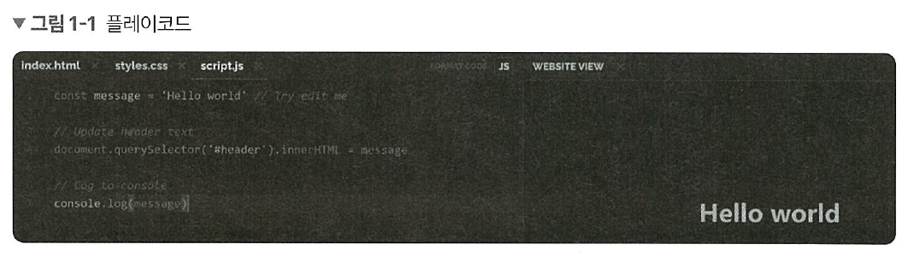
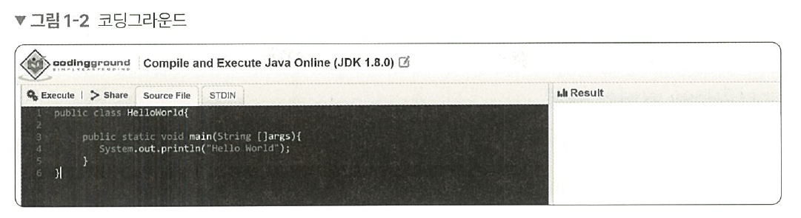
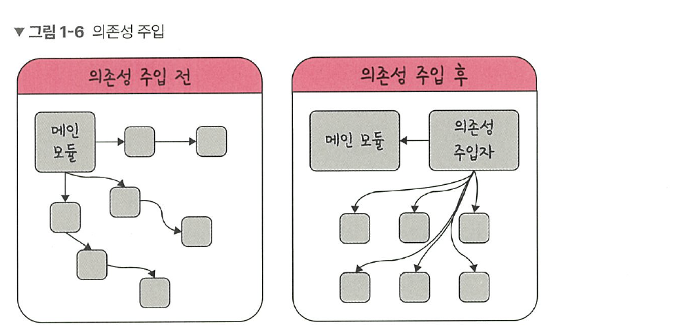

# 1.1 디자인 패턴 
> **💡 구성**
> 
> 1장에서는 디자인 패턴을 다룹니다. 이론뿐만 아니라 실제로 어떻게 디자인 패턴이 쓰이고 있는지를 서술했습니다. 예를 들어 ‘전략 패턴은 passport 라이브러리에서 사용된다’처럼 실무에서 어떻게 사용되고 있는지를 구체적으로 알려줍니다. 예시 코드로는 자바, 자바스크립트 두 가지의 언어로 구성했고, 코드의 난이도를 최대한 낮추면서도 디자인 패턴을 잘 표현하도록 노력했습니다.

우리가 흔히 프로그래밍할 때 쓰는 `React.js` , `Vue.js` , `Spring` 등 라이브러리나 프레임워크의 기본이 되는 디자인 패턴과 크게 보았을 때 어떠한 방식으로 로직을 구성해야 하는지에대한 시각이 담겨 있는 프로그래밍 패러다임을 배워 보겠습니다.

> **💡 용어**
> 
> 1. **라이브러리**  
공통으로 사용될 수 있는 특정한 기능들을 모듈화한 것을 의미한다. 폴더명, 파일명 등에 대한 규칙이 없고 프레임워크에 비해 자유롭다. 예를 들어 무언가를 자를 때 ‘도구’인 **`‘가위’`**를 사용해서 ‘내가’ 직접 컨트롤하여 자르는데, 라이브러리는 이와 비슷하다.
> 2. **프레임워크**  
공통으로 사용될 수 있는 특정한 기능들을 모듈화한 것을 의미한다. 폴더명, 파일명 등에 대한 규칙이 있으며 라이브러리에 비해 좀 더 엄격하다. 다른 곳으로 이동할 때 ‘도구’인 **`비행기`**를 타고 이동하지만 ‘비행기’가 컨트롤하고 나는 가만히 앉아 있어야 한다. 프레임워크는 이와 비슷하다. 

디자인 패턴이란 프로그램을 설계할 때 발생했던 문제점들을 객체 간의 상호 관계 등을 이용하여 해결할 수 있도록 하나의 ‘규약’ 형태로 만들어 놓은 것을 의미합니다.

여기서는 다양한 디자인 패턴을 `JavaScript`, `Java` 로 된 코드와 함께 살펴봅니다. 모든 코드는 별도의 프로그램을 설치하지 않고 웹에서 실행할 수 있습니다. 

자바스크립트는 다음 링크에서 쉽게 테스팅할 수 있습니다.
- 플레이코드 링크 : https://playcode.io/new


자바는 다음 링크에서 쉽게 테스팅할 수 있습니다.
- 코딩그라운드 링크 : https://www.tutorialspoint.com/compilers/online-java-compiler.htm



# 1.1.1 싱글톤 패턴
싱글톤 패턴(singleton pattern)은 하나의 클래스에 오직 하나의 인스턴스만 가지는 패턴입니다. 하나의 클래스를 기반으로 여러 개의 개별적인 인스턴스를 만들 수 있지만, 그렇게 하지 않고 하나의 클래스를 기반으로 단 하나의 인스턴스를 만들어 이를 기반으로 로직을 만드는 데 쓰이며, 보통 데이터베이스 연결 모듈에 많이 사용합니다.


하나의 인스턴스를 만들어 놓고 해당 인스턴스를 다른 모듈들이 공유하며 사용하기 때문에 인스턴스를 생성할 때 드는 비용이 줄어드는 장점이 있습니다. 하지만 의존성이 높아진다는 단점이 있습니다.

## 자바스크립트의 싱글톤 패턴

자바스크립트에서는 리터럴 {} 또는 new Object로 객체를 생성하게 되면 다른 어떤 객체와도 같지 않기 때문에 이 자체만으로 싱글톤 패턴을 구현할 수 있습니다.

자바스크립트에서 싱글톤 패턴은 다음과 같이 만들 수 있습니다.

```jsx
// 코드 위치 : ch1/1.js

const obj = {
    a: 27
}

const obj2 = {
    a: 27
}
console.log(obj === obj2)
// fale
```

앞의 코드에서 볼 수 있듯이 `obj`와 `obj2`는 다른 인스턴스를 가집니다. 이 또한 new Object 라는 클래스에서 나온 단 하나의 인스턴스니 어느 정도 싱글톤 패턴이라 볼 수 있지만, 실제 싱글톤 패턴은 보통 다음과 같은 코드로 구성됩니다.

```jsx
// 코드 위치 : ch1/2.js

class Singleton {
    constructor() {
        if (!Singleton.instance) {
            Singleton.instance = this
        }
        return Singleton.instance
    }
    getInstance() {
        return this
    }
}
const a = new Singleton()
const b = new Singleton()
console.log(a === b)  // true
```

앞의 코드는 `Singleton.instance` 라는 하나의 인스턴스를 가지는 Singleton 클래스를 구현한 모습입니다. 이를 통해 a와 b는 하나의 인스턴스를 가집니다. 

## 데이터베이스 연결 모듈

앞서 설명한 싱글톤 패턴은 데이터베이스 연결 모듈에 많이 쓰입니다.

```jsx
// 코드위치 : ch1/3.js

const URL = 'mongodb://localhost:27017/kundolapp'
const createConnection = url => ({"url" : url})
class DB {
    constructor(url) {
        if (!DB.instance) {
            DB.instance = createConnection(url)
        }
        return DB.instance
    }
    connect() {
        return this.instance
    }
}
const a = new DB(URL)
const b = new DB(URL)
console.log(a === b)  // true
```

이렇게 `DB.instance` 라는 하나의 인스턴스를 기반으로 a, b를 생성하는 것을 볼 수 있었습니다. 이를 통해 데이터베이스 연결에 관한 인스턴스 생성 비용을 아낄 수 있습니다. 

## 자바에서의 싱글톤 패턴

자바로는 다음과 같이 중첩 클래스를 이용해서 만드는 방법이 가장 대중적입니다. 더 자세히 알고 싶다면 필자의 유튜브 채널인 ‘큰돌의 터전 - JAVA로 싱글톤 패턴을 구현하는 7가지 방법’ 영상을 참고해주세요.

```java
// 코드 위치 : ch1/4.java

class Singleton {
    private static class singleInstanceHolder {
        private static final Singleton INSTANCE = new Singleton();
    }
    public static Singleton getInstance() {
        return singleInstanceHolder.INSTANCE;
    }
}

public class HelloWorld {
    public static void main(String[] arge) {
        Singleton a = Singleton.getInstance();
        Singleton b = Singleton.getInstance();
        System.out.printIn(a.hashCode());
        System.out.printIn(b.hashCode());
        if (a == b) {
            System.out.printIn(true);
        }
    }
}
/*
705927765
705927765
*/
```

## mongoose의 싱글톤 패턴


실제로 싱글톤 패턴은 Node.js에서 MongoDB 데이터베이스를 연결할 때 쓰는 mongoose 모듈에서 볼 수 있습니다.

moggoose의 데이터베이스를 연결할 때 쓰는 `connect()` 라는 함수는 싱글톤 인스턴스를 반환합니다. 다음은 `connect()` 함수를 구현할 때 쓰인 실제 코드입니다. 

```jsx
Monggoose.proottype.connect = function(uri, options, callback) {
    const_monggoose = this instanceof Monggoose ? this : monggoose;
    const conn = _mongoose.connection;
    
    return _mongoose._promiseOrCallback(callback, cb => {
        conn.openUri(uri, options, err => {
            if (err != null) {
                return cb(err);
            }
            return cb(null, _mongoose);
        });
    });
};
```

## MySQL의 싱글톤 패턴


Node.js에서 MySQL 데이터베이스를 연결할 때도 싱글톤 패턴이 쓰입니다. 

```jsx
// 메인 모듈
const mysql = require('mysql');
const pool = mysql.createPool({
    connectionLimit: 10,
    host: 'example.org',
    user: 'kundol',
    password: 'secret',
    database: '승철이디비'
});
pool.connect();

// 모듈 A
pool.query(query, function (error, results, fields) {
    if (error) throw error;
    console.log('The solution is: ', results[0].solution);
});

// 모듈 B
pool.query(query, function (error, results, fields) {
    if (error) throw error;
    console.log('The solution is: ', results[0].solution);
});
```

앞의 코드처럼 메인 모듈에서 데이터베이스 연결에 관한 인스턴스를 정의하고 다르모듈인 A 또는 B에서 해당 인스턴스를 기반으로 쿼리를 보내는 형식으로 쓰입니다.

## 싱글톤 패턴의 단점

싱글톤 패턴은 TDD(Test Driven Development)를 할 때 걸림돌이 됩니다. TDD를 할 때 단위 테스트를 주로 하는데, 단위 테스트는 테스트가 서로 독립적이어야 하며 테스트를 어떤 순서로든 실행할 수 있어야 합니다.

하지만 싱글톤 패턴은 미리 생성된 하나의 인스턴스를 기반으로 구현하는 패턴이므로 각 테스트마다 ‘독립적인’ 인스턴스를 만들기가 어렵습니다.

## 의존성 주입

또한, 싱글톤 패턴은 사용하기가 쉽고 굉장히 실용적이지만 모듈 간의 결합을 강하게 만들 수 있다는 단점이 있습니다. 이때 의존성 주입(DI, Dependency Injection)을 통해 모듈 간의 결합을 조금 더 느슨하게 만들어 해결할 수 있습니다.

참고로 의존성이란 종속성이라고도 하며 A가 B에 의존성이 있다는 것은 B의 변경사항에 대해 A 또한 변해야 된다는 것을 의미합니다. 



앞의 그림처럼 메인 모듈(main mudule)이 ‘직접’ 다른 하위 모듈에 대한 의존성을 주기보다는 중간에 의존성 주입자(dependency injector)가 이 부분을 가로채 메인 모듈이 ‘간접’적으로 의존성을 주입하는 방식입니다.

이를 통해 메인 모듈(상위 모듈)은 하위 모듈에 대한 의존성이 떨어지게 됩니다. 참고로 이를 ‘디커플링이 된다’고도 합니다.

> **💡 의존성 주입의 장점**
> 
> 모듈들을 쉽게 교체할 수 있는 구조가 되어 테스팅하기 쉽고 마이그레이션하기도 수월합니다. 또한, 구현할 때 추상화 레이어를 넣고 이를 기반으로 구현체를 넣어 주기 때문에 애플리케이션 의존성 방향이 일관되고, 애플리케이션을 쉽게 추론할 수 있으며, 모듈 간의 관계들이 조금 더 명확해집니다.

> **💡 의존성 주입의 단점**
> 
> 모듈들이 더욱더 분리되므로 클래스 수가 늘어나 복잡성이 증가될 수 있으며 약간의 런타임 패널티가 생기기도 합니다.

> **💡 의존성 주입 원칙**  
>
> 의존성 주입은 “상위 모듈은 하위 모듈에서 어떠한 것도 가져오지 않아야 합니다. 또한, 둘 다 추상화에 의존해야 하며, 이때 추상화는 세부 사항에 의존하지 말아야 합니다.”라는 의존성 주입 원칙을 지켜주면서 만들어야 합니다.