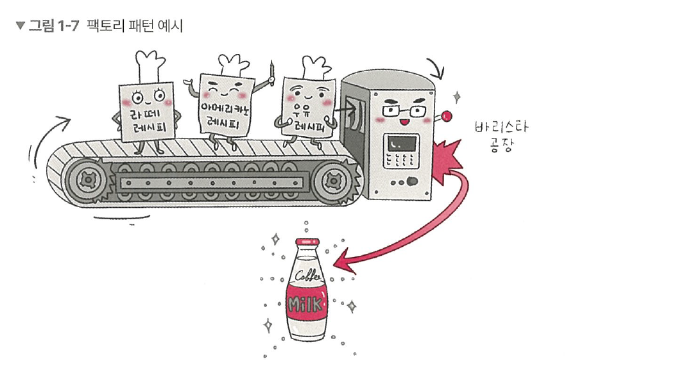

# 1.1.2 팩토리 패턴 
**팩토리 패턴(factory pattern)** 은 객체를 사용하는 코드에서 객체 생성 부분을 떼어내 추상화한 패턴이자 상속 관계에 있는 두 클래스에서 상위 클래스가 중요한 뼈대를 결정하고, 하위 클래스에서 객체 생성에 관한 구체적인 내용을 결정하는 패턴입니다.  
상위 클래스와 하위 클래스가 분리되기 때문에 느슨한 결합을 가지며 상위 클래스에서는 인스턴스 생성 방식에 대해 전혀 알 필요가 없기 때문에 더 많은 유연성을 갖게 됩니다. 그리고 객체 생성 로직이 따로 떼어져 있기 때문에 코드를 리팩터링하더라도 한 곳만 고칠 수 있게 되니 유지 보수성이 증가됩니다.
예를 들어 라떼 레시피와 아메리카노 레시피, 우유 레시피라는 구체적인 내용이 들어 있는 하위 클래스가 컨베이어 벨트를 통해 전달되고, 상위 클래스인 바리스타 공장에서 이 레시피들을 토대로 우유 등을 생산하는 생산 공정을 생각하면 됩니다. 



## 자바스크립트의 팩토리 패턴
자바스크립트에서 팩토리 패턴을 구현한다면 간단하게 new Object()로 구현할 수 있습니다.
```jsx
const num = new Object(42)
const str = new Object('abc')
num.constructor.name;  // Number
str.constructor.name;  // String
```

숫자를 전달하거나 문자열을 전달함에 따라 다른 타입의 객체를 생성하는 것을 볼 수 있습니다. 즉, 전달받은 값에 따라 다른 객체를 생성하며 인스턴스의 타입 등을 정합니다.
커피 팩토리를 기반으로 라떼 등을 생산하는 코드를 구축해보겠습니다.
```jsx
class CoffeeFacotry {
    static createCoffee(type) {
        const factory = factoryList[type]
        return factory.createCoffee()
    }
}

class Latte {
    constructor() {
        this.name = "latte"
    }
}
class Espresso{
    constructor() {
        this.name = "Espresso"
    }
}
class LatteFactory extends CoffeeFactory {
    static createCoffee() {
        return new Latte()
    }
}
class EspressoFactory extends CoffeeFactory {
    static createCoffee() {
        return new Espresso()
    }
}
const factoryList = { LatteFacotry, EspressoFacotry }

const main = () => {
    // 라떼 커피를 주문한다.
    const coffee = CoffeFactory.createCoffee("LatteFactory")
    // 커피 이름을 부른다
    console.log(coffee.name)  // latte
}
main()
```

CoffeeFactory라는 상위 클래스가 중요한 뼈대를 결정하고 하위 클래스인 LatteFactory가 구체적인 내용을 결정하고 있습니다. 
참고로 이는 의존성 주입이라고도 볼 수 있습니다. CoffeeFactory에서 LatteFactory의 인스턴스를 생성하는 것이 아닌 LatteFactory에서 생성한 인스턴스를 CoffeeFactory에 주입하고 있기 때문입니다.
또한, CoffeeFactory 클래스를 보면 static 키워드를 통해 createCoffee() 메서드를 정적 메서드로 선언한 것을 볼 수 있는데, 이렇게 정적 메서드로 정의하면 클래스를 기반으로 객체를 만들지 않고 호출이 가능하며, 해당 메서드에 대한 메모리 할당을 한 번만 할 수 있는 장점이 있습니다.

## 자바의 팩토리 패턴
이를 자바로 구현하면 다음과 같습니다.
```java
enum CoffeeType {
    LATTE,
    ESPRESSO
}

abstract class Coffee {
    protected String name;
    
    public String getName() {
        return name;
    }
}

class Latte extends Coffee {
    public Latte() {
        name = "latte";
    }
}
class Expresso extends Coffee {
    public Expresso() {
        name = "Expresso";
    }
}

class CoffeeFactory {
    public static Coffee createCoffee(CoffeeType type) {
        switch (type) {
            case LATTE:
                return new Latte();
            case EXPRESSO:
                return new Espresso();
            default:
                throw new IllegalArgumentException("Invalid coffee type: " + type);
        }
    }
}

public class Main {
    public static void main(String[] args) {
        Coffee coffee = CoffeeFactory.createCoffee(CoffeeType.LATTE);
        System.out.printIn(coffee.getName());  // latte
    }
}
```

앞의 코드는 CoffeeFactory 밑에 Coffee 클래스를 놓고 해당 클래스를 상속하는 Latte, Espresso 클래스를 기반으로 구현한 모습입니다. 

> **💡 용어**
> 
> 1. **Enum**  
상수의 집합을 정의할 때 사용되는 타입이다. 예를 들어 월, 일, 색상 등의 상수 값을 담는다. 자바에서는 Enum이 다른 언어보다 더 활발히 활용되며, 상수뿐만 아니라 메서드를 집어넣어 관리할 수도 있다. Enum을 기반으로 상수 집합을 관리한다면 코드를 리패터링할 때 상수 집합에 대한 로직 수정 시 이 부분만 수정하면 된다는 장점이 있고, 본질적으로 스레드세이프(thread safe)하기 때문에 싱글톤 패턴을 만들 때 도움이 된다. 참고로 Enum으로 만드는 싱글톤 패턴은 필자의 유튜브 채널, ‘큰돌의 터전 - JAVA로 싱글톤 패턴을 구현하는 7가지 방법’ 영상을 참고하세요.