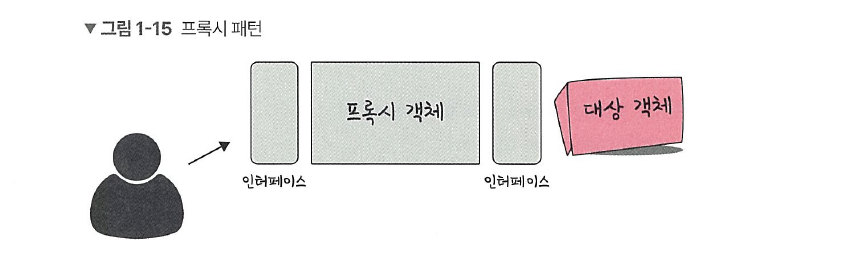
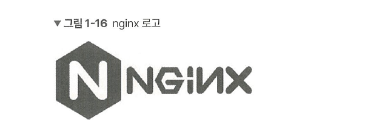
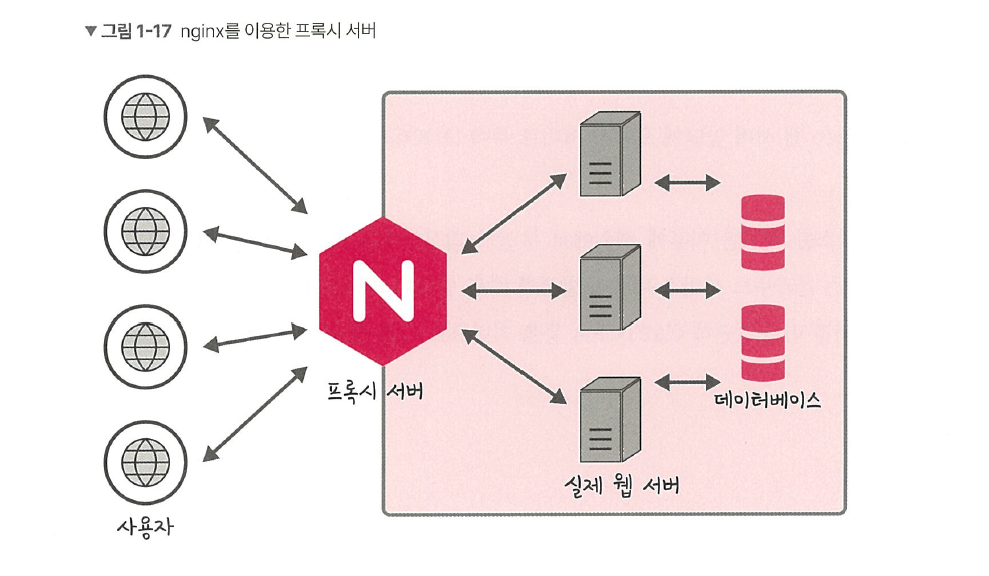
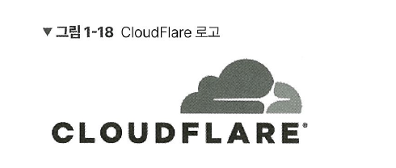
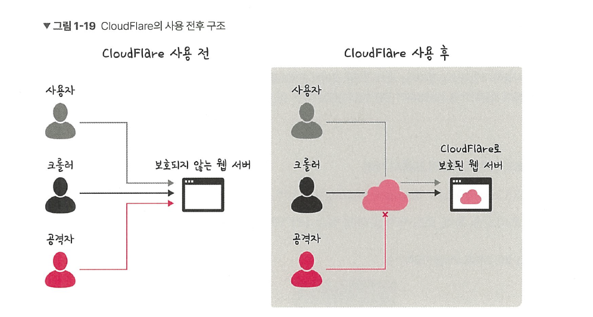
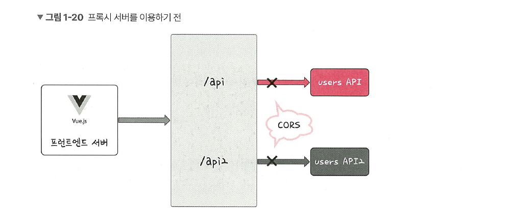
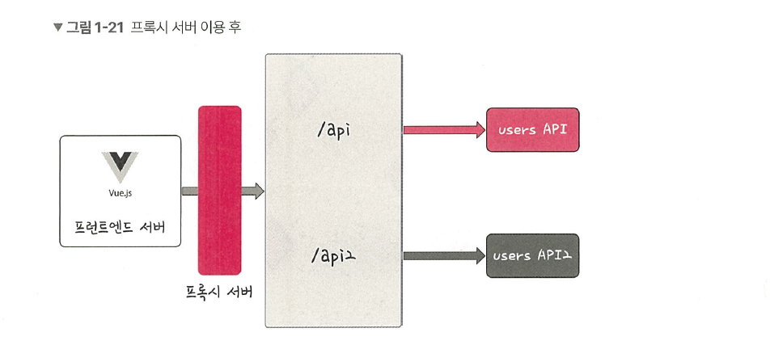

# 1.1.5 프록시 패턴과 프록시 서버

앞서 설명한 프록시 객체는 사실 디자인 패턴 중 하나인 프록시 패턴이 녹아들어 있는 객체입니다. 

## 프록시 패턴
프록시 패턴(proxy pattern)은 대상 객체(subject)에 접근하기 전 그 접근에 대한 흐름을 가로채 해당 접근을 필터링하거나 수정하는 등의 역할을 하는 계층이 있는 디자인 패턴입니다.

이를 통해 객체의 속성, 변환 등을 보완하며 보안, 데이터 검증, 캐싱, 로깅에 사용합니다. 
이는 앞서 설명한 프록시 객체로 쓰이기도 하지만 프록시 서버로도 활용됩니다. 

> **💡 용어**
> 
> **1. 프록시 서버에서의 캐싱**  
캐시 안에 정보를 담아두고, 캐시 안에 있는 정보를 요구하는 요청에 대해 다시 저 멀리 있는 원격 서버에 요청하지 않고 캐시 안에 있는 데이터를 활용하는 것을 말한다. 이를 통해 불필요하게 외부와 연결하지 않기 때문에 트래픽을 줄일 수 있다는 장점이 있다. 

## 프록시 서버
프록시 서버(proxy server)는 서버와 클라이언트 사이에서 클라이언트가 자신을 통해 다른 네트워크 서비스에 간접적으로 접속할 수 있게 해주는 컴퓨터 시스템이나 응용 프로그램을 가리킵니다.

> **프록시 서버로 쓰는 nginx**
> 

nginx는 비동기 이벤트 기반의 구조와 다수의 연결을 효과적으로 처리 가능한 웹 서버이며, 주로 Node.js 서버 앞단의 프록시 서버로 활용됩니다. 

Node.js의 창시자 라이언 달(Ryan Dahl)은 다음과 같이 말했습니다.

“You just may be hacked when some yet-unknown buffer overflow is discovered. Not that couldn’t happen behind nginx, but somehow having a proxy in front makes me happy.”

“Node.js의 버퍼 오버플로우 취약점을 예방하기 위해서는 nginx를 프록시 서버로 앞단에 놓고 Node.js를 뒤쪽에 놓는 것이 좋다.”라고 한 것입니다.

이러한 말은 Node.js 서버를 운영할 때 교과서처럼 참고되어 많은 사람이 이렇게 구축하고 있습니다. Node.js 서버를 구축할 때 앞단에 nginx를 두는 것입니다. 이를 통해 익명 사용자가 직접적으로 서버에 접근하는 것을 차단하고, 간접적으로 한 단계를 더 거치게 만들어서 보안을 강화할 수 있습니다.

앞의 그림처럼 nginx를 프록시 서버로 둬서 실제 포트를 숨길 수 있고 정적 자원을 gzip 압축하거나, 메인 서버 앞단에서의 로깅을 할 수도 있습니다.

> **💡 용어**  
> 
> 1. **버퍼 오버플로우**  
버퍼는 보통 데이터가 저장되는 메모리 공간으로, 메모리 공간을 벗어나는 경우를 말한다. 이때 사용되지 않아야 할 영역에 데이터가 덮어씌워져 주소, 값을 바꾸는 공격이 발생하기도 한다.
> 
> 2. **gzip 압축**  
LZ77과 Hyffman 코딩의 조합인 DEFLATE 알고리즘을 기반으로 한 압축 기술이다. gzip 압축을 하면 데이터 전송량을 줄일 수 있지만, 압축을 해제했을 때 서버에서의 CPU 오버헤드도 생각해서 gzip 압축 사용 유무를 결정해야 한다.

## 프록시 서버로 쓰는 CloudFlare

CloudFlare는 전 세계적으로 분산된 서버가 있고 이를 통해 어떠한 시스템의 콘텐츠 전달을 빠르게 할 수 있는 CDN 서비스입니다.

CloudFlare는 웹 서버 앞단에 프록시 서버로 두어 DDOS 공격 방어나 HTPS 구축에 쓰입니다.

또한, 서비스를 배포한 이후에 해외에서 무언가 의심스러운 트래픽이 많이 발생하면 이 때문에 많은 크라우드 서비스 비용이 발생할 수도 있는데, 이때 CloudFlare가 의심스러운 트래픽인지를 먼저 판단해 CAPTCHA 드을 기반으로 이를 일정 부분 막아주는 역할도 수행합니다.

앞의 그림처럼 사용자, 크롤러, 공격자가 자신의 웹 사이트에 접속하게 될 텐데, 이때 CloudFlare를 통해 공격자로부터 보호할 수 있습니다.

> DDOS 공격 방어
> 

DDOS는 짧은 기간 동안 네트워크에 많은 요청을 보내 네트워크를 마비시켜 웹 사이트의 가용성을 방해하는 사이버 공격 유형입니다. CloudFlare는 의심스러운 트래픽, 특히 사용자가 접속하는 것이 아닌 시스템을 통해 오는 트래픽을 자동으로 차단해서 DDOS 공격으로부터 보호합니다. CloudFlare의 거대한 네트워크 용량과 캐싱 전략으로 소규모 DDOS 공격은 쉽게 막아낼 수 있으며 이러한 공격에 대한 방화벽 대시보드도 제공합니다.

> HTTPS 구축
> 

서버에서 HTTPS를 구축할 때 인증서를 기반으로 구축할 수도 있습니다. 하지만 CloudFlare를 사용하면 별도의 인증서 설치 없이 좀 더 손쉽게 HTTPS를 구축할 수 있습니다. \

> **💡 용어**
> 
> 1. **CDN**  
각 사용자가 인터넷에 접속하는 곳과 가까운 곳에서 콘텐츠를 캐싱 또는 배포하는 서버 네트워크를 말한다. 이를 통해 웹 서버로부터 콘텐츠를 다운로드하는 시간을 줄일 수 있다.

## CORS와 프론트엔드의 프록시 서버
CORS(Cross-Origin Resource Sharing)는 서버가 웹 브라우저에서 리소스를 로드할 때 다른 오리진을 통해 로드하지 못하게 하는 HTTP 헤더 기반 메커니즘입니다.

프론트엔드 개발 시 프론트엔드 서버를 만들어서 백엔드 서버와 통신할 때 주로 CORS 에러를 마주치는데, 이를 해결하기 위해 프론트엔드에서 프록시 서버를 만들기도 합니다.

> **💡 용어**
> 
> **1. 오리진**  
프로토콜과 호스트 이름, 포트의 조합을 말한다. 예를 들어 [`https://kundol.com:12010/test`](https://kundol.com:12010/test) 라는 주소에서 오리진은 `https://kundol.com:12010` 을 뜻한다.

예를 들어 프론트엔드에서는 `127.0;.0.1:3000` 으로 테스팅을 하는데 백엔드 서버는 `127.0.0.1:12010` 이라면 포트 번호가 다르기 때문에 CORS 에러가 나타납니다. 이때 프록시 서버를 둬서 프론트엔드 서버에서 요청되는 오리진을 `127.0.0.1:12010` ㅇ,로 바꾸는 것입니다. 

참고로 `127.0.0.1` 이란 루프백(loopback) IP로, 본인 PC 서버의 IP를 뜻합니다. localhost나 `127.0.0.1` 을 주소창에 입력하면 DNS를 거치지 않고 바로 본인의 PC 서버로 연결됩니다.

앞의 그림처럼 프론트엔드 서버 앞단에 프록시 서버를 놓아 `/api` 요청은 users API, `/api2` 요청은 API2에 요청할 수 있습니다. 자연스레 CORS 에러 해결은 물론이며 다양한 API 서버와의 통신도 매끄럽게 할 수 있는 것입니다.

CORS에 대한 자세한 설명은 필자의 유튜브 채널, ‘큰돌의 터전 - CORS’ 영상을 참고하세요.