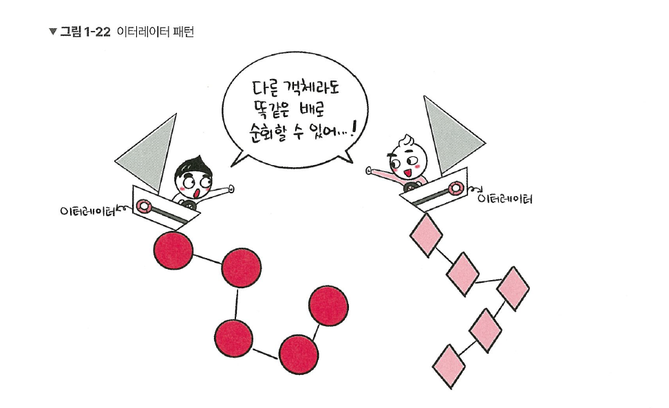

# 1.1.6 이터레이터 패턴

이터레이터 패턴(iterator pattern)은 이터레이터(iterator)를 사용하여 컬렉션(collection)의 요소들에 접근하는 디자인 패턴입니다. 이를 통해 순회할 수 있는 여러 가지 자료형의 구조와는 상관없이 이터레이터라는 하나의 인터페이스로 순회가 가능합니다. 



앞의 그림은 이터레이터라는 똑같은 배로, 동그라미로 이루어진 컬렉션이든 마름모로 이루어진 컬렉션이든 순회할 수 있는 것을 보여줍니다.

## 자바스크립트에서의 이터레이터 패턴

```jsx
const mp = new Map()
mp.set('a', 1)
mp.set('b', 2)
mp.set('c', 3)
const st = new Set()
st.add(1)
st.add(2)
st.add(3)
for (let a of mp) console.log(a)
for (let a of st) console.log(a)
/*
[ 'a', 1 ]
[ 'b', 2 ]
[ 'c'. 3 ]
1
2
3
*/
```

분명히 다른 자료 구조인  set과 map임에도 똑같은 for a of b 라는 이터레이터 프로토콜을 통해 순회하는 것을 볼 수 있습니다.

> **💡 용어**
> 
> **1. 이터레이터 프로토콜**  
이터러블한 객체들을 순회할 때 쓰이는 규칙
> 
> **2. 이터러블한 객체**  
반복 가능한 객체로 배열을 일반화한 객체 
