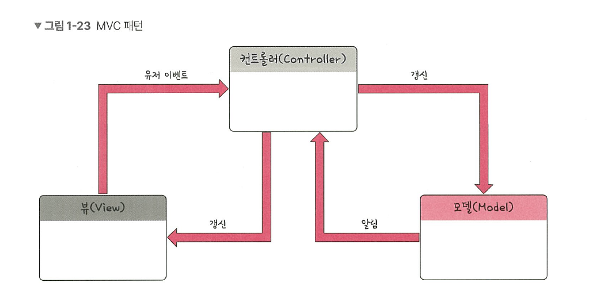
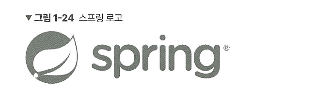

# 1.1.8 MVC 패턴
MVC 패턴은 모델(Model), 뷰(View), 컨트롤러(Controller)로 이루어진 디자인 패턴입니다. 

애플리케이션의 구성 요소를 세 가지 역할로 구분하여 개발 프로세스에서 각각의 구성 요소에만 집중해서 개발할 수 있습니다. 재사용성과 확장성이 용이하다는 장점이 있고, 애플리케이션이 복잡해질수록 모델과 뷰의 관계가 복잡해지는 단점이 있습니다.

## 모델
모델(model)은 애플리케이션의 데이터인 데이터베이스, 상수, 변수 등을 뜻합니다.  
예를 들어 사각형 모양의 박스 안에 글자가 들어 있다면 그 사각형 모양의 박스 위치 정보, 글자 내용, 글자 위치, 글자 포맷(utf-8 등)에 관한 정보를 모두 가지고 있어야 합니다. 뷰에서 데이터를 생성하거나 수정하면 컨트롤러를 통해 모델을 생성하거나 갱신합니다.

## 뷰
뷰(view)는 inputbox, checkbox, textarea 등 사용자 인터페이스 요소를 나타냅니다. 즉, 모델을 기반으로 사용자가 볼 수 있는 화면을 뜻합니다. 모델이 가지고 있는 정보를 따로 저장하지 않아야 하며, 단순히 사각형 모양 등 화면에 표시하는 정보만 가지고 있어야 합니다.  
또한, 변경이 일어나면 컨트롤러에 이를 전달해야 합니다.

## 컨트롤러
컨트롤러(controller)는 하나 이상의 모델과 하나 이상의 뷰를 잇는 다리 역햘을 하며 이벤트 등 메인 로직을 담당합니다. 또한, 모델과 뷰의 생명주기도 관리하며, 모델이나 뷰의 변경 통지를 받으면 이를 해석하여 각각의 구성 요소에 해당 내용에 대해 알려줍니다. 

## MVC 패턴의 예 - 스프링
MVC 패턴을 이용한 대표적인 프레임워크로는 자바 플랫폼을 위한 오픈 소스 애플리케이션 프레임워크인 스프링(spring)이 있습니다.

스프링의 WEB MVC는 웹 서비스를 구축하는 데 편리한 기능들을 많이 제공합니다. 예를 들어 `@RequestParam`, `@RequestHeader`, `@PathVariable` 등의 애너테이션을 기반으로 사용자의 요청 값들을 쉽게 분석할 수 있으며 사용자의 어떠한 요청이 유효한 요청인지를 쉽게 거를 수 있습니다. 예를 들어 숫자를 입력해야 하는데 문자를 입력하는 사례 같은 것입니다. 또한 재사용 가능한 코드, 테스트, 쉽게 리디렉션할 수 있게 하는 등의 장점이 있습니다.

스프링에 대한 자세한 설명은 필자의 유튜브 채널, ‘큰 돌의 터전 - Spring과 MVC 패턴’ 영상을 참고하세요.