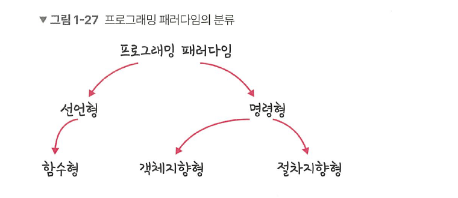

# 1.2 프로그래밍 패러다임 
프로그래밍 패러다임(programming paradigm)은 프로그래머에게 프로그래밍의 관점을 갖게 해주는 역할을 하는 개발 방법론입니다.

예를 들어 객체지향 프로그래밍은 프로그래머들이 프로그램을 상호 작용하는 객체들의 집합으로 볼 수 있게 하는 반면에, 함수형 프로그래밍은 상태 값을 지니지 않는 함수 값들의 연속으로 생각할 수 있게 해줍니다.

어떤 언어는 특정한 패러다임을 지원하기도 하는데, jdk  1.8 이전의 자바는 객체지향 프로그래밍을 지원하는 반면에, 하스켈은 함수형 프로그래밍을 지원합니다. 여러 패러다임을 지원하는 언어로는 C++, 파이썬, 자바스크립트가 있으며 자바의 경우 jdk 1.8부터 함수형 프로그래밍 패러다임을 지원하기 위해 람다식, 생성자 레퍼런스, 메서드 레퍼런스를 도입했고 선언형 프로그래밍을 위해 스트림(stream) 같은 표준 API 등도 추가했습니다. 

프로그래밍 패러다임은 크게 `선언형`, `명령형` 으로 나누며, 선언형은 함수형이라는 하위 집합을 갖습니다. 또한, 명령형은 다시 객체지향, 절차지향으로 나눕니다.




# 1.2.1 선언형과 함수형 프로그래밍

선언형 프로그래밍(declarative programming)이란 ‘무엇을’ 풀어내는가에 집중하는 패러다임이며, “프로그램은 함수로 이루어진 것이다.” 라는 명제가 담겨 있는 패러다임이기도 합니다. 함수형 프로그래밍(functional programming)은 선언형 패러다임의 일종입니다. 지금부터 함수형 프로그래밍에 대해 알아보겠습니다.

예를 들어 자연수로 이루어진 배열에서 최댓값을 찾으려고 한다면 다음과 같이 로직을 구성합니다. 

```jsx
const list = [1, 2, 3, 4, 5, 11, 12]
const ret = list.reduce((max, num) => num > max ? num : max, 0)
console.log(ret)  // 12
```

앞의 코드에서 `reduce()`는 ‘배열’만 받아서 누적한 결괏값을 반환하는 순수 함수입니다. 

함수형 프로그래밍은 이와 같은 작은 ‘순수 함수’들을 블록처럼 쌓아 로직을 구현하고 ‘고차 함수’를 통해 재사용성을 높인 프로그래밍 패러다임입니다. 자바스크립트는 단순하고 유연한 언어이며, 함수가 일급 객체이기 때문에 객체지향 프로그래밍보다는 함수형 프로그래밍 방식이 선호됩니다.

## 순수 함수
출력이 입력에만 의존하는 것을 의미합니다.

```jsx
const pure = (a, b) => {
	return a + b
}
```

`pure` 함수는 들어오는 매개변수 a, b에만 영향을 받습니다. 만약 a, b 말고 다른 전역 변수 c 등이 이 출력에 영향을 주면 순수 함수가 아닙니다.

## 고차 함수
고차 함수란 함수가 함수를 값처럼 매개변수로 받아 로직을 생성할 수 있는 것을 말합니다.

> **💡 일급 객체**
> 
> 이때 고차 함수를 쓰기 위해서는 해당 언어가 일급 객체라는 특징을 가져야 하며 그 특징은 다음과 같습니다.
> - 변수나 메서드에 함수를 할당할 수 있습니다.
> - 함수 안에 함수를 매개변수로 담을 수 있습니다.
> - 함수가 함수를 반환할 수 있습니다.

참고로 함수형 프로그래밍은 이외에도 커링, 불변성 등 많은 특징이 있습니다. 함수형 프로그래밍의 심화, 응용 사례 등을 자세히 알고 싶다면 <실시간 모니터링 시스템을 만들며 정복하는 MEVN>(BJ퍼블릭, 2021)을 읽는 것을 추천합니다.